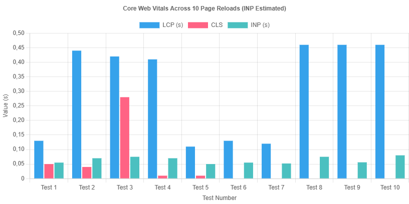
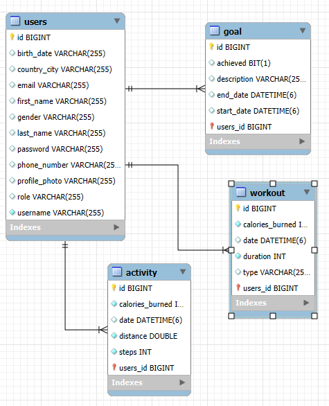
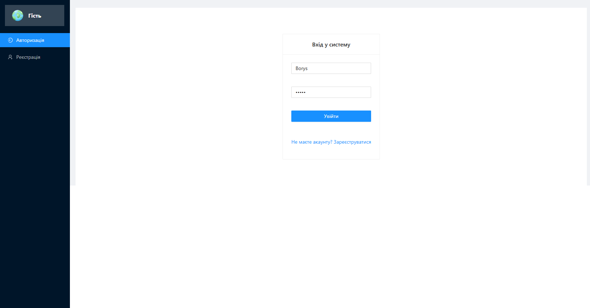
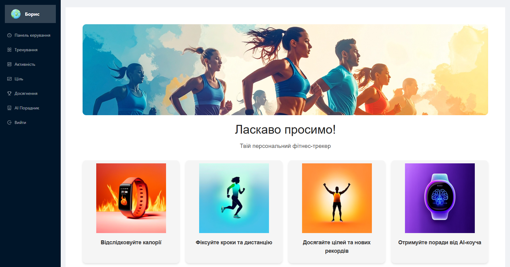
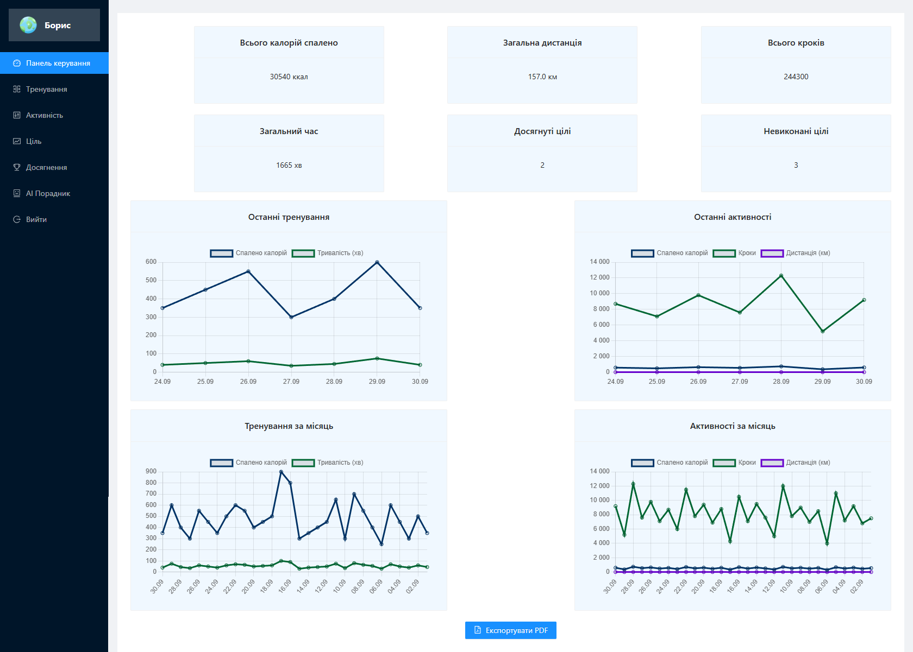
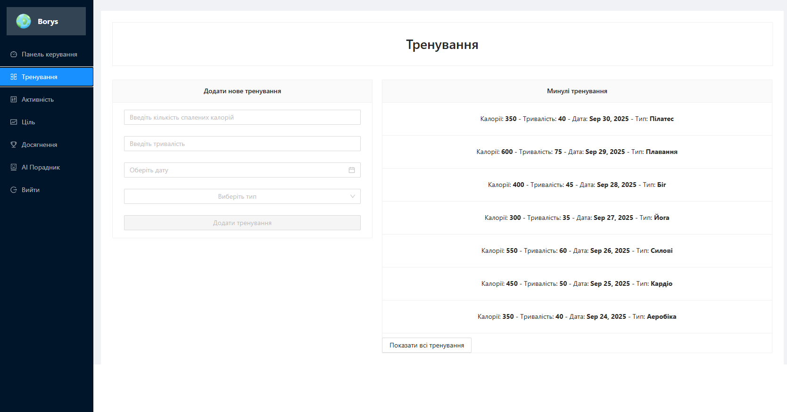
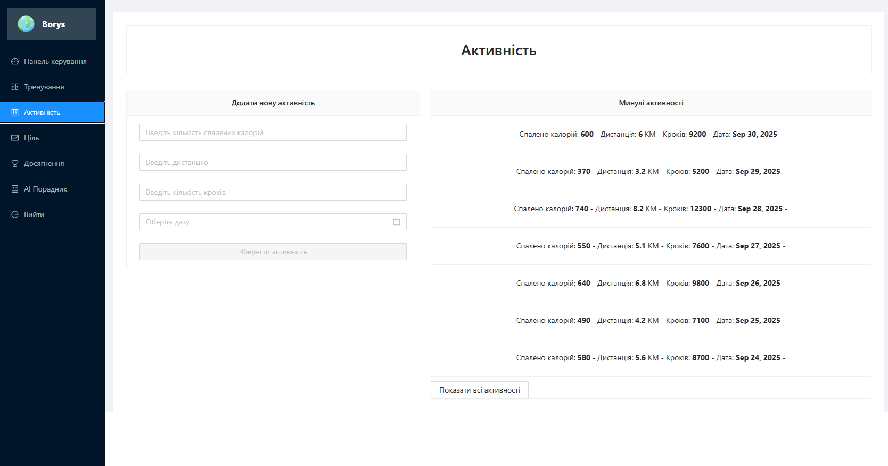
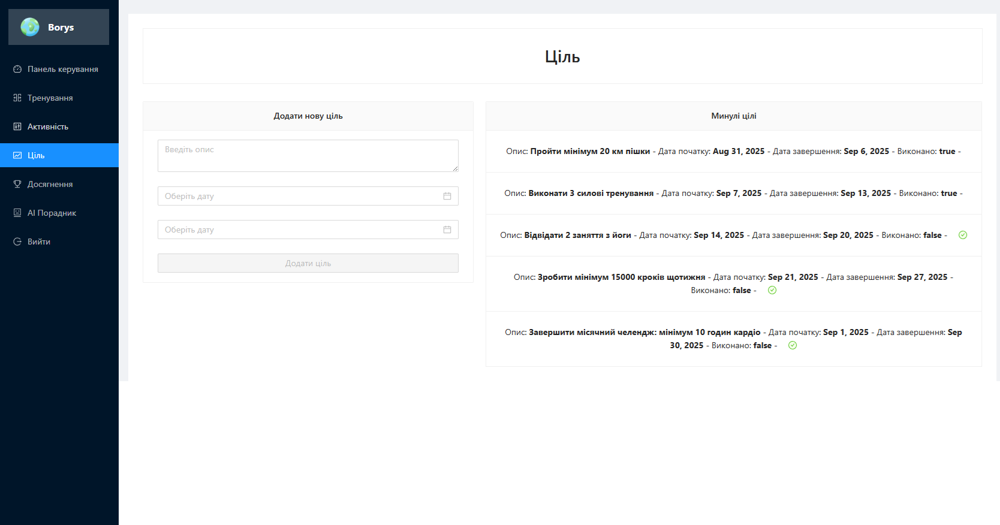
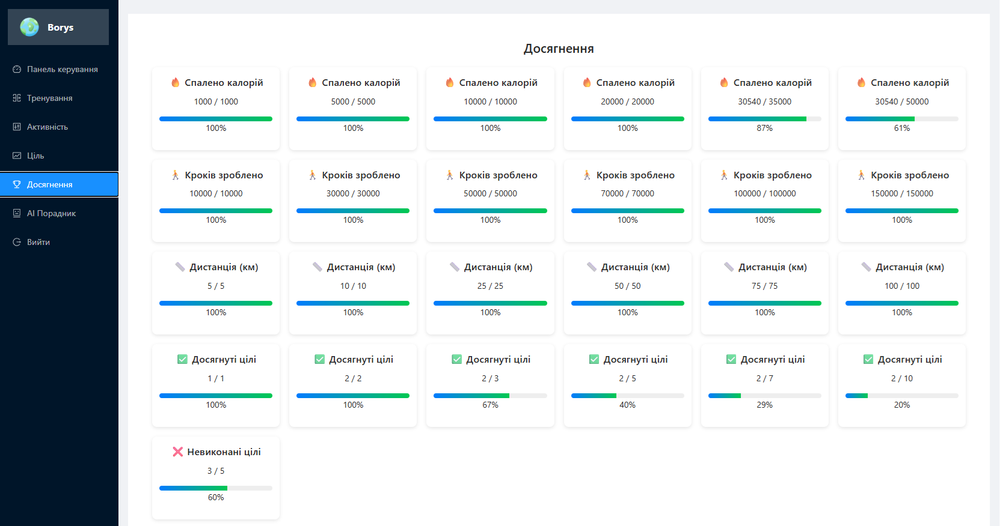
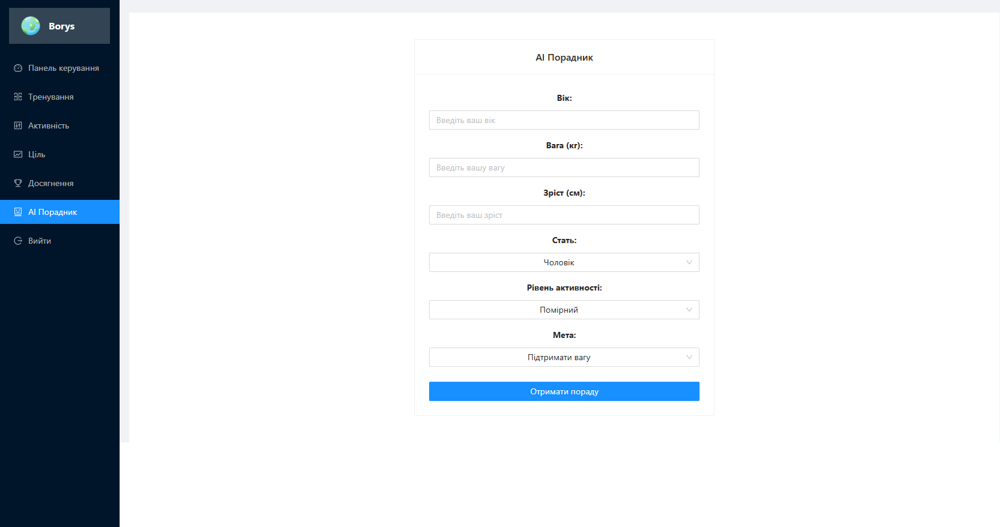

# fit-ai-tracker

FitnessWeb is a full-stack **fitness tracking system** built with:
- Backend: **Java 17 + Spring Boot**
- Frontend: **Angular 20**
- Database: **MySQL**
- AI Layer: TensorFlow.js + rule-based smart assistant

The system focuses on **fitness analytics, AI coaching, activity tracking, and personalized recommendations**.

---

## Development Tools


---

## Technologies

### Backend (Java / Spring Boot)


---

### Frontend (Angular)


---

### AI & Analytics


---

## Project Focus

This project is built around 3 main pillars:

### 1. Fitness Tracking System
- Workouts tracking
- Daily activity (steps, calories, distance)
- Goal management system
- Progress analytics

### 2. AI Fitness Assistant
- Smart workout recommendations
- Intensity analysis
- Activity recognition (walk/run/workout detection)
- Training optimization suggestions
- Injury prevention insights

### 3. Data Integration Layer
- Fitness wearables support (planned)
- Apple Health integration (planned)
- Google Fit integration (planned)
- Smartwatch data sync (planned)

---

## Features

### Authentication & Users
- User registration (no encryption for learning/demo version)
- Login system
- Role-based structure (USER / ADMIN)
- Session state (Angular local state)

### Core Fitness Modules
- Workout tracking
- Activity tracking (steps, distance, calories)
- Goal system (create / update / complete)
- Achievements (gamification layer)
- Analytics dashboard (weekly/monthly stats)

### AI Features (Frontend + Logic Layer)
- AI Coach module
- Smart workout suggestions
- Basic anomaly detection (TensorFlow.js ready structure)
- Notification system (training reminders)
- Progress insights

### Extra Features
- Push notifications
- PDF export of reports (jsPDF)
- Interactive charts (Chart.js)
- Dashboard analytics

---

## Screenshots

### Performance Chart


### DB


### Login


### Welcome page


### Dashboard


### Workout page


### Activity tracker


### Goal system


### Achievements


### AI Coach


---

## Backend Architecture

### Structure

```
controller/
dto/
entity/
repository/
services/
```

### Main Modules

#### Activity Module
- Tracks steps, distance, calories
- REST:
  - `POST /api/activity`
  - `GET /api/activities`

#### Workout Module
- Stores workout sessions
- REST:
  - `POST /api/workout`
  - `GET /api/workouts`

#### Goal Module
- Fitness goals management
- REST:
  - `POST /api/goal`
  - `GET /api/goals`
  - `GET /api/goal/status/{id}`

#### Stats Module
- Aggregates system data
- Provides:
  - total steps
  - calories burned
  - workout duration
  - achieved goals
- REST:
  - `GET /api/stats`
  - `GET /api/graphs`

#### User Module
- Registration & login
- REST:
  - `POST /api/register`
  - `POST /api/login`

---

## AI Coach

### 1. Smart Fitness Intelligence
- AI-based workout plan generation
- Adaptive intensity scaling
- Rest day prediction

### 2. Health Data Intelligence
- Detect fatigue patterns
- Injury risk detection
- Performance trend prediction

### 3. Activity Recognition AI
- Walking detection
- Running detection
- Workout classification

### 4. Recommendation Engine
- Personalized workout plans
- Nutrition suggestions (future)
- Recovery optimization

---

## Database Design

Main tables:
- users
- activity
- workout
- goal

Analytics:
- aggregated stats (computed via service layer)

---

## Setup Instructions

### Backend (Spring Boot)

```bash
mvn clean install
mvn spring-boot:run
```

## Database
```
CREATE DATABASE fitness_tracker_db;
```

## Frontend (Angular)
```
npm install
ng serve
```

### UI & Visualization
* Chart.js → progress analytics
* Ng Zorro → UI components
* PDF export → reports generation
* Responsive dashboard layout

